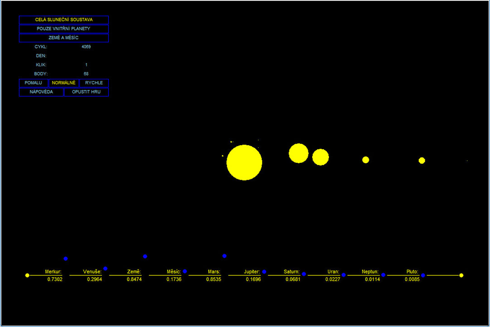

# Orbital

Původní inspirací k programu bylo [cvičení 10. lekce](../Cviceni/10_18%20[kolecko%20meni%20rychlost%20a%20smer].py). Kolečko, které se pohybuje po kružnici a mění směr. 

Odtud pak přišel nápad vytvořit model sluneční soustavy na základě skutečných hodnot. A změnu směru pohybu kolečka použít pro změnu směru pohybu planet. Úkolem hry by pak bylo dostat všechny planety a Měsíc do jedné roviny. 

Po dvou měsících byl program téměř hotov, a na řadě už jen dotáhnout samotnou hru. A to byla i chvíle, kdy jsem ukončil vývoj. Jednak program již splnil úkol procvičit dosavadní látku, ale navíc jsem tušil, že budou i lepší postupy než ty, co jsem použil, a tak jsem se vrátil k učení a pokračoval dál.

Máte-li nainstalovaný Python, můžete si [program](/Fluorit/Orbital/Orbital.py) stáhnout a sami vyzkoušet. Nejprve je třeba zvolit rozlišení, a hned potom se už můžete kochat přepínáním mezi jednotlivými pohledy. Můžete vstoupit i do hry. Ta běží, ale nevyhodnocuje skóre.   

A jen pro zajímavost ještě dodám, že v tomto měřítku by Slunce nezabralo ani 2 pixely a planety by nebyly vidět vůbec.

[*Zpátky na předchozí stránku*](https://github.com/Sudip2708/3roky/tree/main/Fluorit#obdob%C3%AD-fluoritu)
