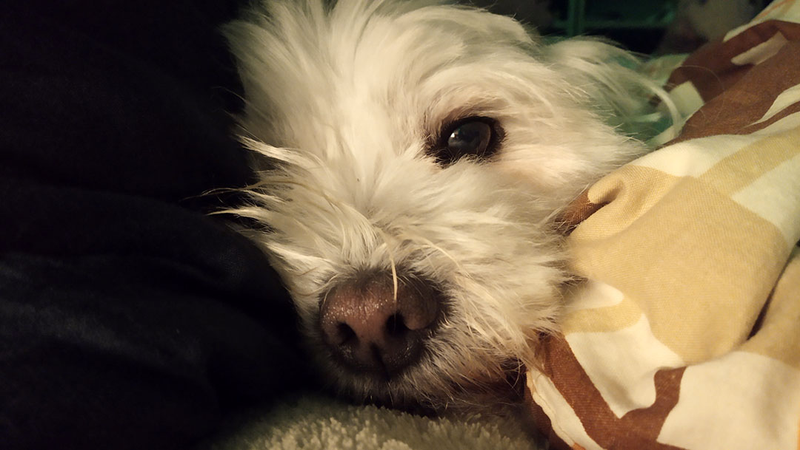
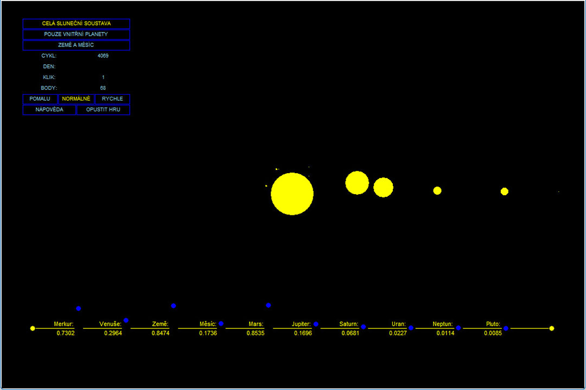
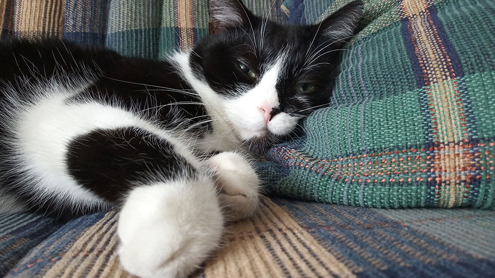

# Období Fluoritu

Do Fluoritu jsem nastupoval už s tím, že učit se chci Python. Chvilku mi ale trvalo, než jsem si vybral podle čeho. Volba nakonec padla na [materiály od Andreje Blaha](/Fluorit/Ucebnice/). Hlavně pro jejich širší záběr a odbornost.

Nikam jsem nespěchal, a tak jsem zvolil pomalejší tempo. Přednost mělo látku co nejlépe pochopit, a až pak se šlo dál. Díky distanční výuce v době covidu jsem každou lekci mohl začínat i výukovým videem. [Pak přišly na řadu výpisky](/Fluorit/Vypisky/), a po nich následoval ten nejdůležitější úsek, [splnit všechny úkoly](/Fluorit/Cviceni/).

V období po probrání základů, před tím, než OOP přišlo na řadu, na 2 měsíce jsem se zakousl do vlastního programu. [Na hru přišla inspirace](/Fluorit/Orbital/), dělanou v TKinteru. A i když jsem ji zcela nedokončil, spustit se dá. A máte-li Python, můžete si ji i vyzkoušet.

A jen pro zpestření, tohle je Mikeš.  
Ten tu s námi bydlí taky.

[*Zpátky na hlavní stránku*](https://github.com/Sudip2708/3roky#31-b%C5%99ezna-2023)

