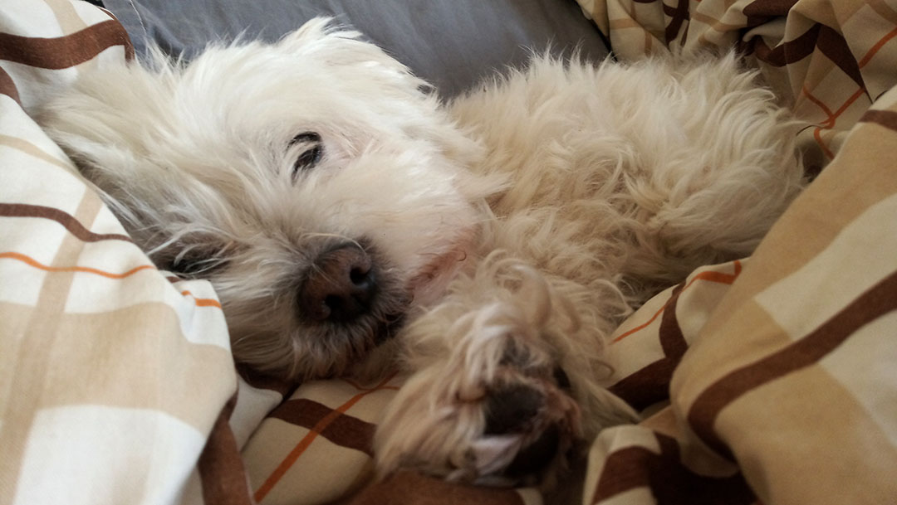
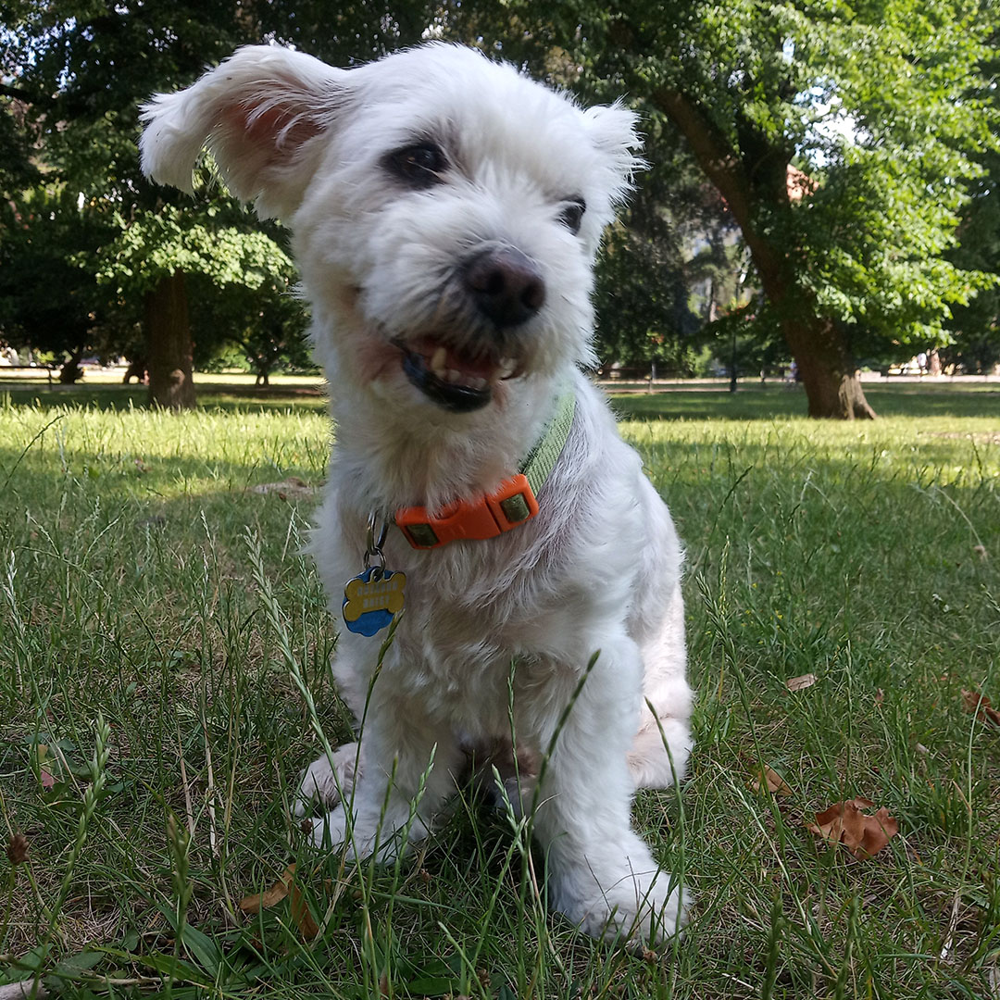

# Období kurzu od IT Network

Kurz od IT Network byl oproti mému předchozímu učení na vrátnici úplně nový level. Učení hodně a času málo. Stále jsem si ale chtěl udržet své návyky, a tak jsem vše měnil ve vlastní výpisky. Ty mi pak velice pomohli při závěrečné zkoušce, pro kterou jsem si je seskupil do základních bloků: [HTML/CSS, Python a databáze](/ITNetwork/Vypisky/). A to bylo i to, co jsem pak vytisknuté předal kolegovi, který seděl vedle mě a zkoušku neudělal. Doufám tedy, že i jemu pomohly a napodruhé už to dal. 

Za celý můj život jsem se nikdy tak moc neučil, jako během těchto tří měsíců. A o co více do hloubky jsem šel, o to více vše trvalo. Závěrečným projektem pak měla být aplikace, jenž by všechny prvky spojila. Zbylo mi však na ni málo času. A když už bylo jasné, že ji do termínu nedokončím, odevzdal jsem alespoň to, co jsem měl, a ono to stačilo. [Projekt rozložený na jednotlivé kroky](/ITNetwork/Zaverecny_projekt/), na kterých jsem si chtěl ozkoušet, co a jak funguje.

[*Zpátky na hlavní stránku*](https://github.com/Sudip2708/3roky#28-%C4%8Dervence-2023)