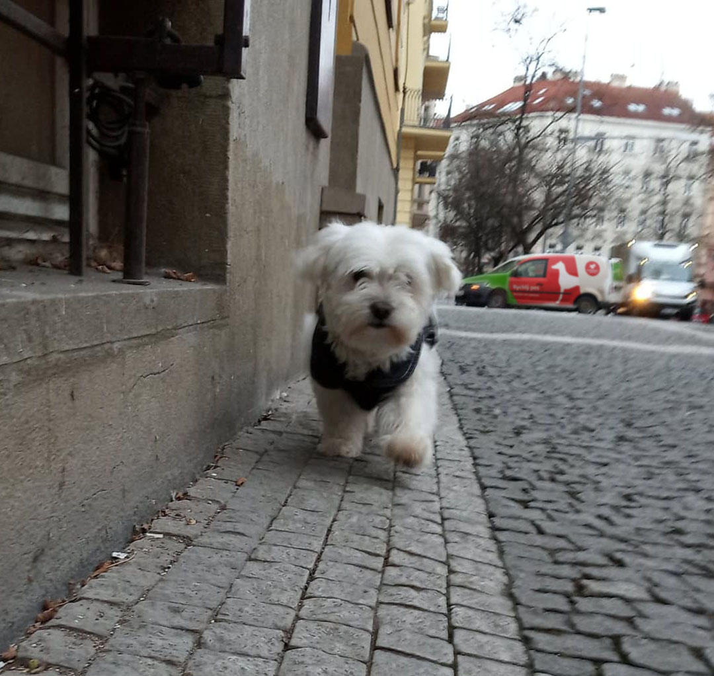
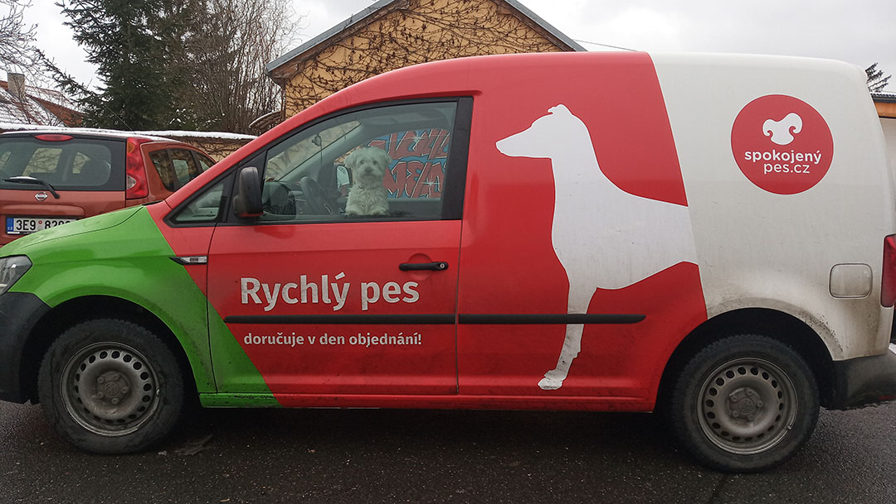
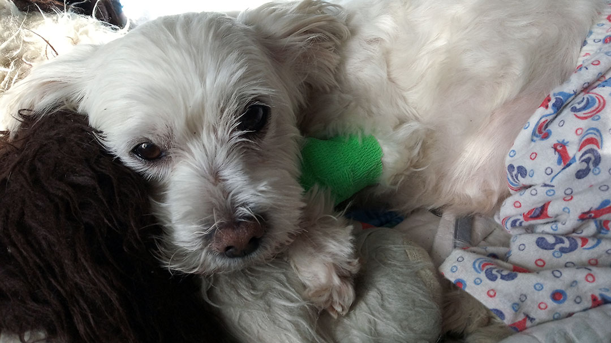
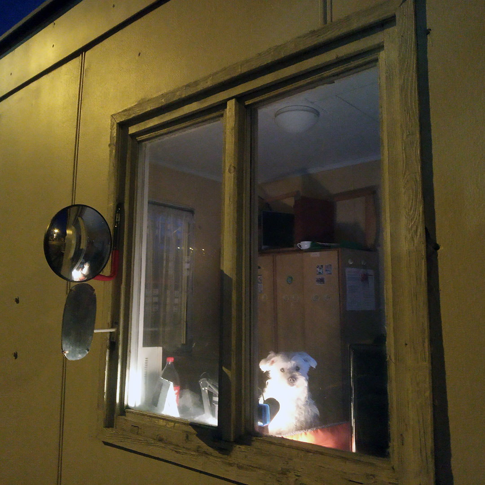
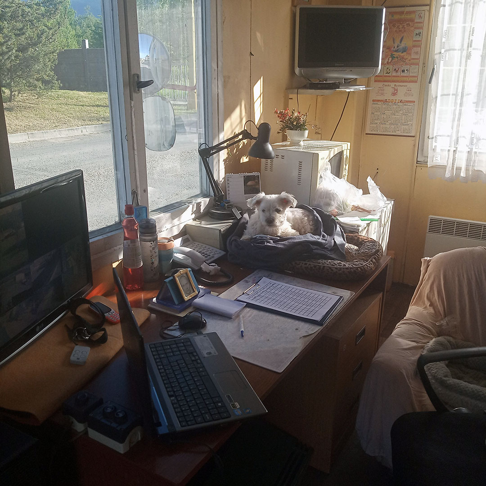
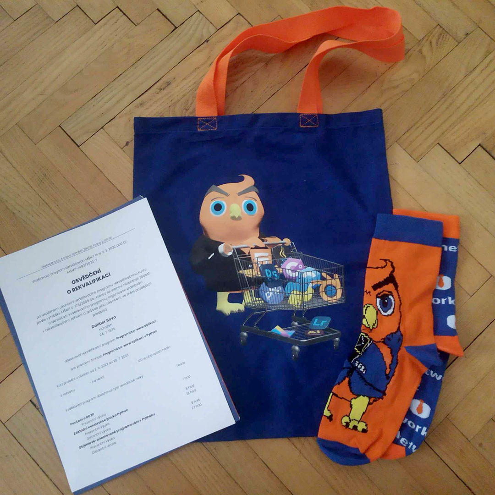
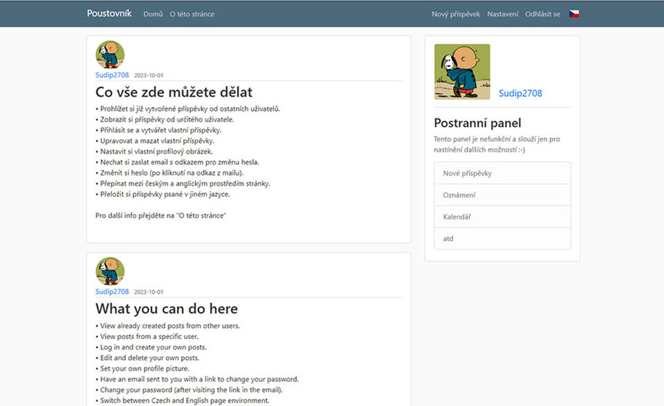
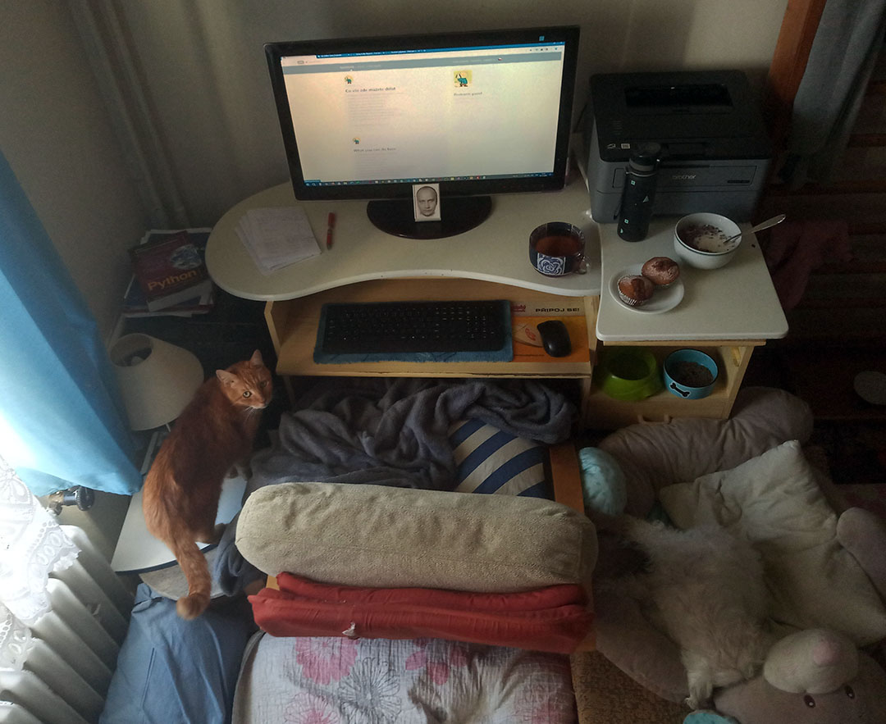
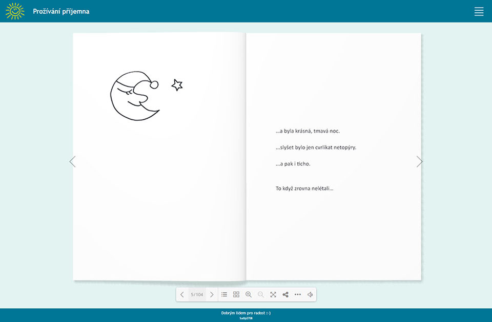
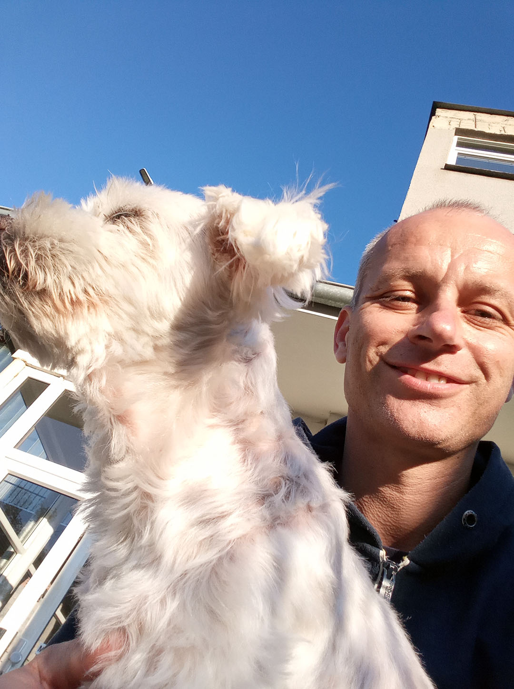

# Pes, který mě naučil programovat

### 7. 10. 2020

**Je tu!** Už potřetí vidím na tom samém místě stejného pejska. Malou tulačku, plnou špinavých dredů. 

Poprvé to bylo před týdnem a uvnitř mě okamžitě něco sepnulo. Spěchám ale za zákazníkem, a tak se jen konejším, že určitě někomu patří a jedu dál. Podruhé to bylo před tři čtvrtě hodinou, a zase tady, na tom samém místě. A znovu to sepnutí. A znovu spěchám za zákazníkem. To už si ale slibuji, že pokud tady bude, až se budu vracet, určitě zastavím.

A je to tu! Vystupuji a obcházím auta za ní na chodník. Provokativně poskočí předními packami dopředu, a s výzvou ke hře si mě poměřuje. Zašátrám tedy v autě s nápisem Spokojený pes, plného psích dobrot a granulí. Hned jsme byli kamarádi. A konečně si ji mohu i prohlédnout. Celá zadredovaná, ale vychrtlá není. A najednou znovu nejistota. Určitě něčí je.

V ten stejný moment, co prochází mi tohle hlavou, jde kolem mladý člověk a jen co se ho na ní zeptám, začne vyprávět. Je to prý místní tulačka, a je prý hrozně hodná. Na jídlo netrpí, ale páníčka nebo domov žádný nemá. Když jsem pak navrhl, že bych ji mohl odvést a pokusit se zajistit lepší život, bylo vidět, jak je za ni rád a se slovy, že by si to moc zasloužila, mi s ní pomohl do auta.

Vydáváme se na cestu a oběma nám začíná velké dobrodružství.  
Dobrodružství jenž trvá až dodnes.

> [*Jak ten den dopadl*](/Texty/Co_bylo_dal.md)

#
### 17. ledena 2021

**Dneska se to stalo, a v práci jsem řekl, že dávám výpověď.** Co budu dělat dál, ještě přesně nevím, ale rozhodně vím, že chci být někde, kde bude moci být i se mnou malý pejsek a kde to nebude vadit ani jemu.

Moc dobře už vím, že to nebyla náhoda. Tolik jsem odolával představě, že bych si ji mohl nechat a snažil se jí najít lepší život jinde. Po oddredování se ze špinavého mopu vyklubala krásná princezna, která chtěla být jen se mnou. Tomu se nedalo odolat.

Takhle to prostě mělo být. Najednou už nekopu jen za sebe, ale taky za ni. Její štěstí je moje štěstí, a tak dokola. Najednou už nedává smysl 10 hodin denně strávit v autě. To, co mě dříve bavilo, najednou tolik už nebaví. Dělat cizím pejskům radost je příjemný pocit, ale ne ve chvíli, když ten váš musí čekat doma.

A dneska se to teda stalo, výpověď podaná. Co bude nevím, ale věřím, že bude dobře.

> [*Proč jsem pracoval pro Spokojeného psa*](/Texty/Co_predchazelo.md)

#
### 23. červenec 2021

**Mám práci!** A nejen tak ledajakou. Mám práci, o který jsem snil, ale nevěřil, že najdu.

S Rozárkou jsme se přesunuli z Prahy do Teplic pod rodinnou střechu. Tady je klid a nám je dobře. Pracuji na druhém dílu knížečky a učím se programovat. Programování je moje touha, na kterou však nikdy předtím nebyl čas. Potřebuji ale více času. A tak sháním práci, kde by nevadil pes a já se mohl učil. A světe div se, já takovou práci našel!

Od příštího měsíce nastupuji jako vrátný ve firmě Fluorit Teplice. Pejsek nevadí a času prý budu mít taky hodně. Důležité hlavně je, abych tam byl.

> [*Můj první program*](/Texty/Prvni_program.md)

#
### 31. března 2023

**Dneska naposled jsme na vrátnici** a od zítra nás s Rozárkou čeká další dobrodružství. Ten rok a půl tady uběhl neskutečně rychle. Tolik jsem se toho naučil a tolik toho ještě potřebuji vědět.

Neuvěřitelné štěstí bylo, když jsem narazil na výukové materiály prvního ročníku Univerzity Komenského v Bratislavě. Kde v rámci distanční výuky v době covidu byla k dispozici i videa s podrobným výkladem k probíranému učivu od Andreje Blaha. Pan Blaho je vynikající učitel a ohromně mi sedl. Je pravda, že rok a půl mi trvalo to, na co jeho studenti mají tři čtvrtě roku, a k tomu ještě i hromadu jiných předmětů. Já ale nikam nespěchal a například cvičení, ze kterých si na škole mohli vybrat jen pár, já dělal všechna.

Základy v Pythonu mám tedy za sebou a přede mnou již další krok předpřipraven. Na pracovním úřadě už mám podanou žádost na rekvalifikační kurz programování webových aplikací v jazyce Python od firmy IT Network.

Popravdě nevím, co mám od toho čekat, ale byl to další krok, který se nabízel. Třetí díl knížečky už je skoro taky hotový, a tak nadešel čas.

> [*Učební podklady a první hra*](/Fluorit/) 

#
### 28. července 2023

**Je to tam! Mám to!** Závěrečná zkouška úspěšně za mnou!

A to jsem měl z ní takový respekt, že jsem se až přeučil. Test, který měl půl hodiny limit, jsem měl hotový za necelých 5 minut. Skoro se mi až nechtělo věřit, že to bylo tak snadné. V tu chvíli mi ale radost utlumil kolega, který seděl vedle mě, a který tak dobře připravený nebyl. A když viděl, že já mám už hotovo, spustila se mu krev z nosu. Nakonec byl jedním ze čtyř, kteří to nedali. Nechal jsem mu své poznámky, ze kterých měl upřímnou radost. Za měsíc má druhou možnost, tak snad už to bude mít v pohodě.

Naučil jsem se ale hodně. K Pythonu se přidala tvorba webu a databáze. Obojí něco, co i mně se hodí a tak jsem se učil s chutí, a ono se to povedlo. Je mi ale jasné, že stále jsem na počátku. Teď se hlavně musím doučit ještě Django, a vytvořit alespoň jeden projekt. Něco, s čím bych se mohl prezentovat při hledání práce.

Pro teď je ale hotovo! Za kurz nemusím platit, a to se počítá.

> [*Podklady pro závěrečnou zkoušku*](/ITNetwork/)  

#
### 10. září 2023

Trvalo to déle, než jsem čekal, ale **projekt už je na světě!** Teď už ho jen nahrát na net, a hurá hledat práci.

Po kurzu jsem měl týden pauzu. Mozek si o ní řekl. Chudák byl přetažený a vůbec se mu nechtělo přemýšlet. Ale jasný, pauzu dostal, však si ji zasloužil. Alespoň byl prostor, v klidu vymyslet co dál. Tak jsem narazil i na výuková videa od Corey Shafer, podle kterých jsem svůj projekt vytvořil. Corey Shafer je další velká výhra, další dobrý učitel a moc jsem se toho od něj naučil. Ale samozřejmě tím největším učitelem byl Google.

Trvalo mi 14 dní, než jsem měl aplikaci hotovou podle videí. Dalších 14 dní jsem se v ní hrabal a dělal vlastní úpravy, včetně lokalizace. Ale je hotovo!
Tak šup s tím na web a rychle hledat práci.

 

> [*Podrobný rozbor programu (v češtině)*](https://github.com/Sudip2708/poustovnik-rozbor)  
> [*Konečná podoba programu (snažící se dodržovat Best Practice)*](https://github.com/Sudip2708/poustovnik-english)

#
### 2. října 2023

**Konečně je to i na netu!** To to zase trvalo. Ale je to tam, a vše funkční. Ufff ufff, a děkuji! To byla škola!

Corey v posledních videích vysvětluje upload na Linux server Linode. Když jsem to poprvé viděl, nechtělo se mi to všechno podstupovat, a tak jsem hledal jednodušší cestu. Něco přeci musí být. Hledal, ale všechno co jsem našel, mělo nějaký to „ale“, a poté, co i Google zklamal s cenou, kterou si chtěl účtovat za databázi, s pokorou jsem se navrátil ke Coreyho postupu.

A ono to najednou šlo. A složitost mizela s každým dalším krokem. A najednou jsem byl tam, kde jsem chtěl být. Stránky jsou na netu a vypadají hezky. Ještě jednou díky, Corey. Moc díky za to, co jsi vytvořil!

> *Odkaz na stránku:* [*Poustovnik.fun*](https://poustovnik.fun) 

#
### 31. října 2023

**Hotovo! Hotovo! Hotovo!** Skoro měsíc uběhl od posledního zápisu. Měsíc, na jehož konci jsem se viděl už jako zaměstnán. Měsíc, na jehož konci jsem teprve připraven. 

Po nahrání stránek na net jsem se začal věnovat věcem, na které do té doby nebyl čas. Založit si na LinkedIn profil, vytvořit nový životopis a pár dalších věcí okolo. A když už bylo hotovo, zazněl ještě jeden úkol. Bylo to zevnitř, takže nešlo říct ne.
"Teď, když už víš, jak se dělají stránky, mohl bys udělat i nový kabát stránkám s knížečkou!"
To jsou stránky mně ze všech nejmilejší. Poklad a zdroj radosti. Nešlo odmítnout. Obzvlášť, když byly v tak žalostném stavu, že ani https neměly.

Odhadl jsem to tak na 2-3 dny práce, ale nakonec to bylo 14. Teď už ale mají všechno tak, jak má být. Dokonce i po zadání „Prožívání příjemna“ do Googlu se objeví na prvním místě. Nejvíc mi ale dává radost, že vypadají přesně tak, jak jsem si vždycky přál. Jednoduchost bez kompromisů. Za to moc děkuji!

Hotovo! Hotovo! Hotovo! A teď už jen ta práce…

> *Odkaz na stránku:* [*Prožívání příjemna*](https://www.prozivaniprijemna.cz/)

#
### 14. listopadu 2023

A pokud jste dočetli až sem, tak tady **už se dostáváme až k dnešku.** Hledám práci a potřeboval bych ji najít rychle. Podpora už nepřijde, a tak jde trochu i o život 😊 Uvědomuji si, že jsem stále na začátku, a to co umím, bude asi všude málo. Mám ale velkou chuť dál se učit, tak věřím, že co bude třeba, rychle doženu.

Od svých 21 let medituji a programování je dalším dílem skládačky. Rád bych se ubíral směrem k neuronovým sítím. Tam mě to táhne. Umělá inteligence byl jeden ze dvou hlavních důvodů, proč jsem si vybral Python. Vybírat si však v tuto chvíli moc nemohu, a tak jsem otevřen jakékoliv práci, která by šla dělat z domu. 

Mezi mé hlavní přednosti patří od táty poděděné logické myšlení a od mámy schopnost empatie. Mínusem je určitě moje dyslexie a její dopad na rodný jazyk. Češtinu mám velmi rád, ale gramatika mi nejde. Všechno, co napíšu, musím pracně a dlouho kontrolovat, a často i přes veškerou snahu se nějaká ta chybka najde. Samotnou dyslexii však vnímám jako pozitivní věc. Dává mi schopnost odhlédnout od problémů a zaměřit se více na celek.

O peníze tolik nejde. Momentálně mi stačí přežít a tak rád budu pracovat i za minimální plat. Rád bych se ale dál rozvíjel, a tak ideální práce je s dobrými lidmi, od kterých bych se mohl učit. Anebo práce na částečný úvazek.

Jestli takovouto práci najdu, nevím. A kdo ví, třeba jste to vy, kdo mi ji nabídne. Pokud jste to vy, pak už teď se těším na spolupráci. A pokud ne, pak velmi moc děkuji za přečtení tohoto textu a doufám, že jsem vás alespoň trochu pobavil.  
A všem vám přeji příjemný život, plný radosti a vnitřní pohody.

S přátelským pozdravem  
Dalibor Sova

> [*"Mimoškolní aktivita"*](/Texty/Mimoskolni_aktivita.md)   
> [*LinkedIn*](https://www.linkedin.com/in/dalibor-sudip-sova/)   
> [*Facebook*](https://www.facebook.com/sudip.sova/)  
> [*Životopis*](/Obrazky/CV_CZ_DaliborSova_231024.pdf)  

[*Zpátky úplně až nahoru*](https://github.com/Sudip2708/3roky)

