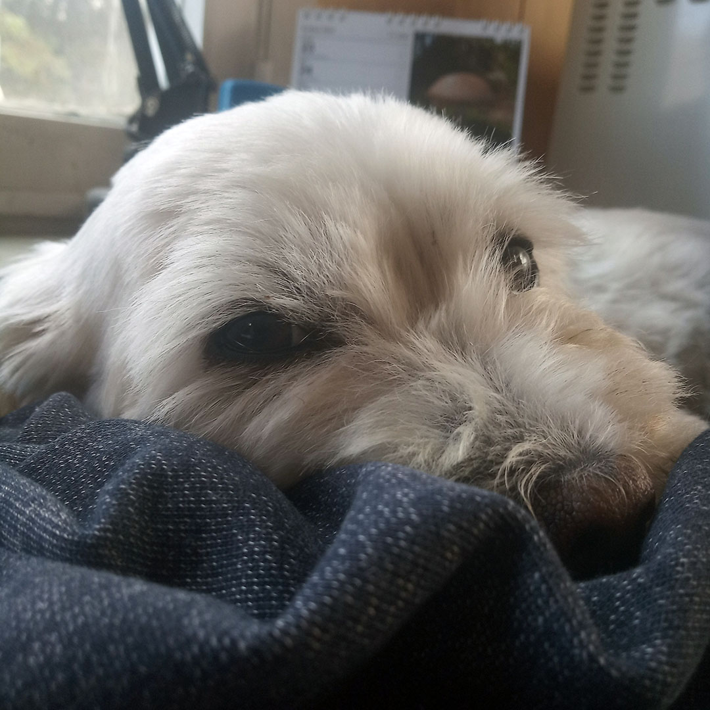

# A jak to bylo dál

### Ten den a pár dní po tom

Ve chvíli, kdy jsem se s Rozárkou potkal, měl jsem před sebou ještě půl dne práce. Narychlo jsem pro ni našel azyl u kamarádky, která sama má početnou zvířecí rodinu, takže pejsek navíc ji nevadil. I Rozárce se tam líbilo a měla to tam jak v psí školce. A tak až do konce týdne přes práci zůstávala tady. 

Na víkend se jelo domů. Byla to naše první cesta vlakem a já jen žasnul, jak je to s ní všechno v pohodě. Nejraději bych si ji nechal. Nechtěl jsem ji však přivést do situace, kdy přes práci by musela být zavřená doma. Přeci jenom do teď si žila volně a byla svobodná. 

[I na Facebooku jsem měl inzerát.](https://www.facebook.com/sudip.sova/posts/pfbid02iPFZ1VNQf2CnbdCjM7ySD11WWpsUjjJR4MWDZuTQGtfLsLXaZ5jAMa1VzNibgk6Vl) Ale nakonec všechno marné. Už jsem byl na ni namotaný a jen tak někomu bych ji nedal. A i ona chtěla být jen se mnou. A tak po víkendu bylo rozhodnuto. Rozárka zůstane u mě, a nějak si holt budeme muset poradit.

#
### A začal život...

Když už bylo jasné, že cestování jí nevadí, začal jsem ji brát do práce. Ježdění po psích zákaznících milovala a i já byl rád, že je se mnou. Ideální to ale nebylo. Těch 10 hodin v autě na ni bylo hodně, a tak jsem ji bral jen na půl dne. To však zase bylo náročnější pro mě, a tak jsem začal hledat jinou cestu, kudy dál. 

Z vnitřních hlubin se tak znovu vynořila touha naučit se programovat. Byla to pradávná touha a představa něčeho, co by mě mohlo bavit, a co by se dalo dělat z domova. Myšlenka po pár měsících uzrála ve výpověď v práci, a zase se jelo do Teplic pod rodinnou střechu. Tentokrát však už na dýl.

#
### Sladká nezaměstnanost
V Teplicích to Rozárku rozhodně baví, to je vidět. Nejen, že tu má zahrádku, ale i všude po městě chce courat a všechno objevovat. A i mně je tady dobře. Dokončuji práci na druhé knížečce a s Rozárkou zažíváme, co je to příjemný život.  

Po čase však zjišťuji, že naučit se dobře programovat za pár měsíců je vcelku utopie. Tak přichází na řadu plán najít si práci, kde budu moci býti se psem, a dál se učit. Na hodně inzerátů jsem tohle napsal. A z jednoho se mi najednou ozvali. Pejsek prý nevadí a práce je to na vrátnici, a tak i na učení bude čas. Jen by to potřebovali rychle. A tak jsem nastoupil. 

Práce to nebyla vůbec těžká. Hlavní náplní bylo mačkat čudlík, kterým se zvedala brána a zapisovat do knihy auta, kterých jezdilo pomálu.    
Na učení naprosto ideální a s Rozárkou nám bylo dobře.

#
### Přerod

Rok a půl na vrátnici utekl rychle, a před námi je další krok. Tříměsíční intenzivní kurz programování webových aplikací, jakožto vstupenka do programátorského světa. 

A byly to intenzivní 3 měsíce. Zmizely víkendy a ze dnů se stal stereotyp, kdy od počítače mě zachraňovaly jen vycházky s Rozárkou. Nemám ale nic, na co bych si mohl stěžovat. Jsem doma se svým psem a učím se to, co sám chci vědět. 

I Rozárka je ráda, že nemusí už trávit dny a noci na vrátnici. Už dávno se stala mým souputníkem. Nejbližším společníkem, jenž mi dělá život lepším. Každá změna, kterou jsem kvůli ní musel udělat, se mi vždy vyplatila. A není už pochyb o tom, že mi vešla do života, aby pomohla i ona mně.

Je neuvěřitelné, že jsem narazil na takto dokonalého a hodného pejska.  
S Rozárky se stal můj poklad největší.

[*Zpátky na hlavní stránku*](https://github.com/Sudip2708/3roky#7-10-2020)

