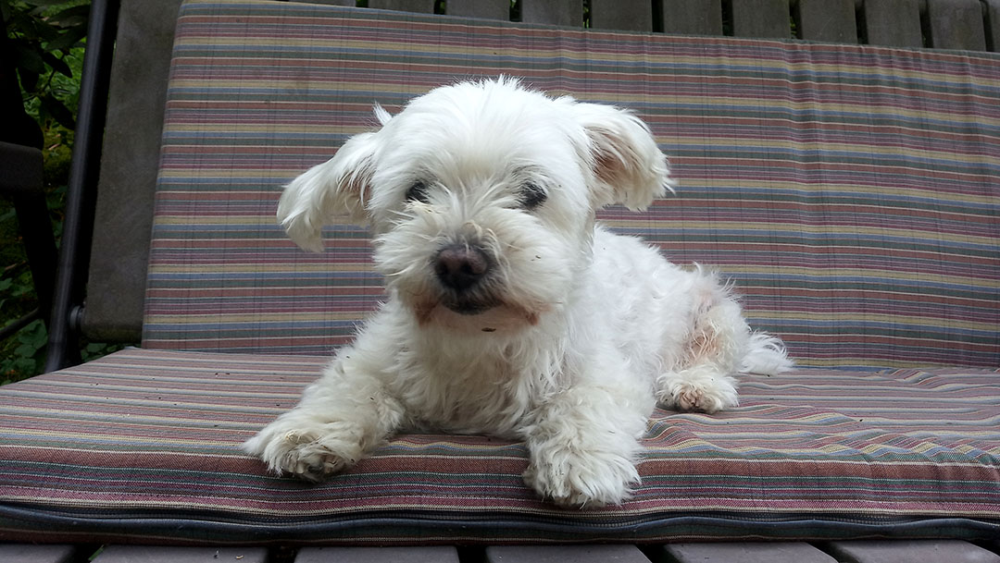
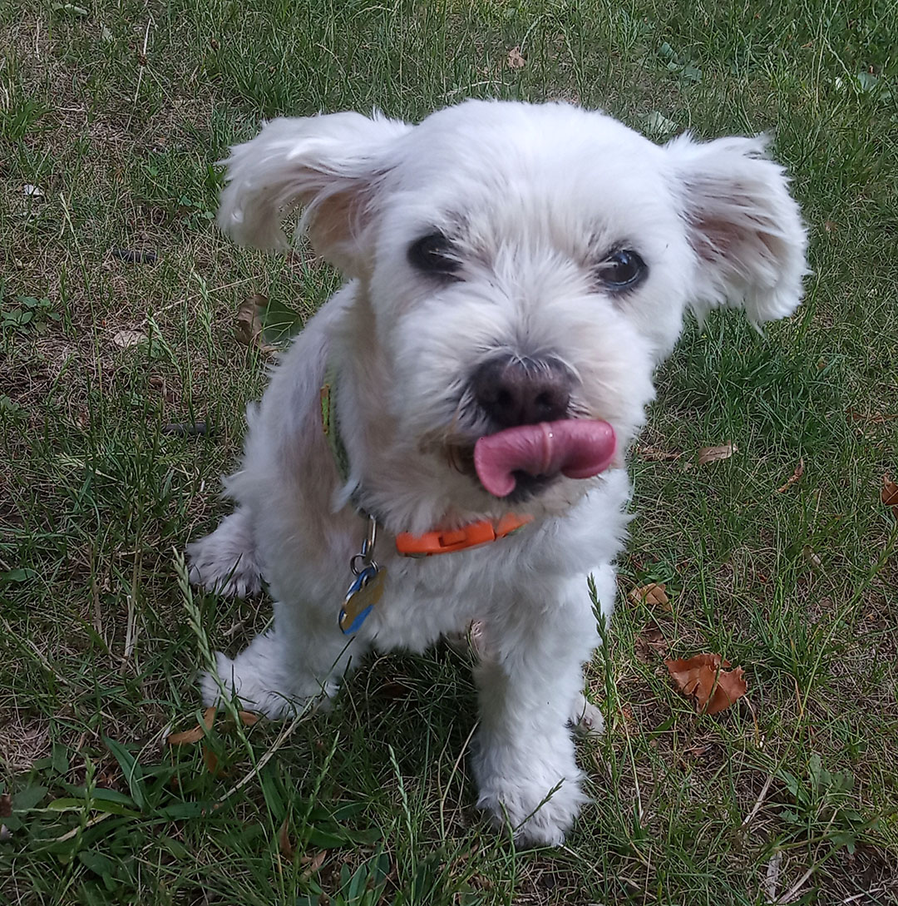
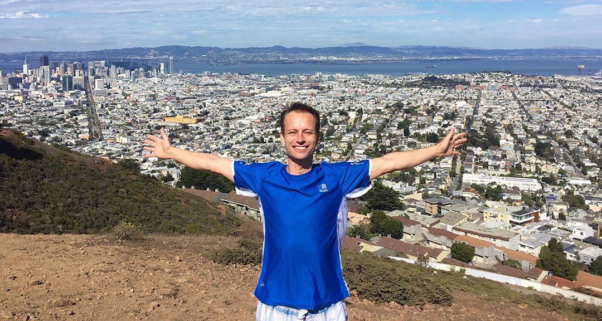
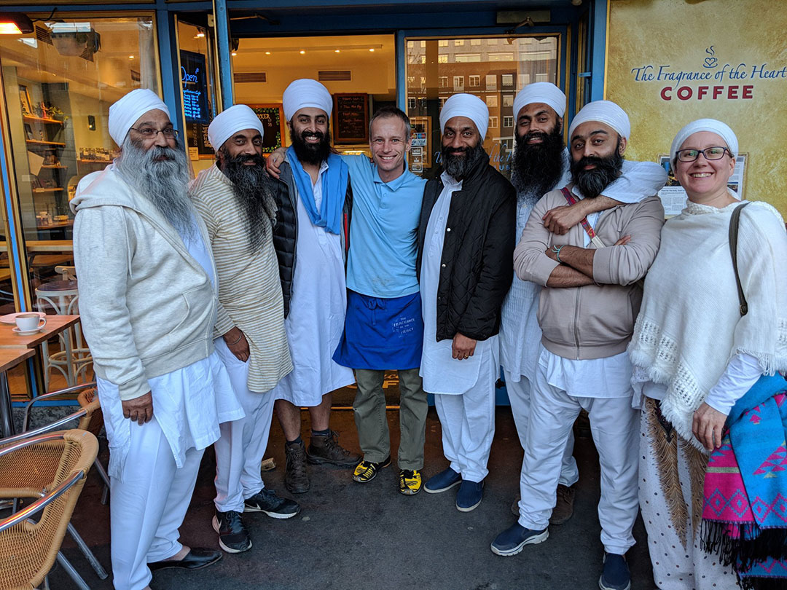

# Jak jsem se dostal k rozvážení granulí

### Bod zlomu - insolvence

Počátek mé novodobé historie sahá do roku 2018, kdy v prosinci došlo k ukončení mé zahraniční pracovní pouti a já se vrátil do Čech. V zahraničí bylo dobře, ale začalo se mi stýskat po rodině, po přátelích, a hlavně po tom, co mi tu uniká.

Rozhodnutí to tak bylo víc emotivní než z pozice rozumu, a tak jsem se vrátil dříve, než jsem doplatil všechny dluhy. Situace, kterou jsem se časem rozhodl řešit insolvencí. Hlavní motivací byla mylná informace, že v insolvenci se dluh rozpočítá na 5 let a když po 3 letech splatíte alespoň 60%, zbytek se vám odpouští. Mně to tak vycházelo na necelých pět tisíc, což bylo víc než v pohodě.

Tady už na řadu přichází Spokojený pes, jakožto práce, kterou jsem si na toto období našel. Jaké však bylo překvapení, když po skoro ročním procesu mi byla stržena první splátka, po které mi z výplaty zbylo 12 tisíc. Původní informace byla správná jen zčásti. Procenta sedí, ale bere se vše kromě minima.

Ale i tak jsem zůstal odhodlaný. Necouvnu a prostě to dám. Alespoň, že mám dobrou práci.  
A do toho najednou přišla Rozárka. A dál už to znáte...

#
### Dluh, jenž nikdy nebyl litován

Ačkoliv sám nejsem srdcem cestovatel, život mi dával příležitosti cestovat a já je využil. Nebál jsem se na cestování si i půjčovat. Jednak jsem měl v té době dobrou a stabilní práci, ale hlavně jsem i vytušil, že to, co se mi nabízí nyní, nemusí se už nikdy opakovat. Rád jsem ty peníze dal a dodnes nelituji. A to říkám z pozice, kdy vše už je splaceno.

Do konce života budu těžit z toho, co jsem v mládí za tyto 3 poslední roky života zažil. Navíc i tyto 3 roky byly tak přínosné. Jak bych mohl litovat. Život je krásný. A zbyla jen vděčnost.

#
### A kam, že jsem se to všude podíval

Nikdy jsem neměl moc peněz navíc, a tak když už jsem někam jel a bylo to daleko, snažil jsem se tam být co nejdéle. Nejvíce mě to táhlo do New Yorku, tam bydlel můj guru, můj duchovní učitel. A protože na zimu se přesouval do teplejších krajin, začal jsem tam jezdit taky. 

Bali, Malajsie, Kambodža, Thajsko, Myanmar, Čína. A velkým zážitkem pro mě byla Dominikánská republika. A pak i pobyt v San Franciscu. Z Evropy je pak po Čechách Norsko mou druhou nejoblíbenější zemí. Pár měsíců jsem tam pracoval v kavárně v Oslu na náměstí a Nory mám moc rád. Za nimi jsou pak Holanďané a dál zbytek Evropy :-)

Jeden z těch super dnů v kavárně v Norsku. To k nám zrovna zavítali účastníci městských oslav turbanů. A pro ty, kdo to ještě neví, Sikhové mají vynikající smysl pro humor :-)

> *A pokud máte rádi fotky, tak tady je pár alb, na které se dá podívat:*   
> [*NY - 2017*](https://www.facebook.com/media/set/?set=a.10212429893601347&type=3)  
> [*San Francisco - 2015 (Všechno co se dalo fotit)*](https://www.facebook.com/media/set/?set=a.10205912159222061&type=3)   
> [*San Francisco - 2015 (Jenom Street Art a Grafity)*](https://www.facebook.com/media/set/?set=a.10205913368452291&type=3)   
> [*Národní park Yosemite - 2015*](https://www.facebook.com/media/set/?set=a.10205913647379264&type=3)   
> [*Muir Woods Sekvoje - 2015*](https://www.facebook.com/media/set/?set=a.10205913860384589&type=3)   
> [*Punta Cana - 2007*](https://www.facebook.com/media/set/?set=a.1121180028648&type=3)  
> [*Bali - 2009*](https://www.facebook.com/media/set/?set=a.1121176188552&type=3)  

[*Zpátky na hlavní stránku*](https://github.com/Sudip2708/3roky#17-ledena-2021)