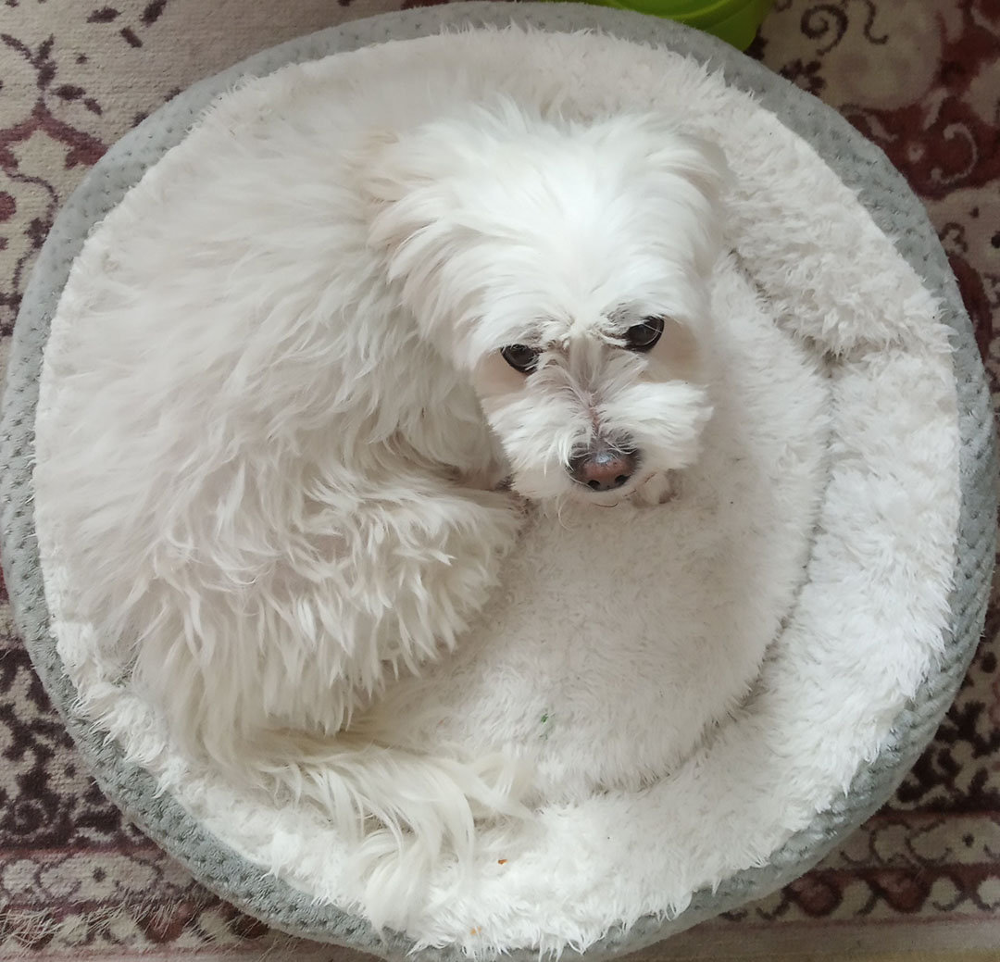
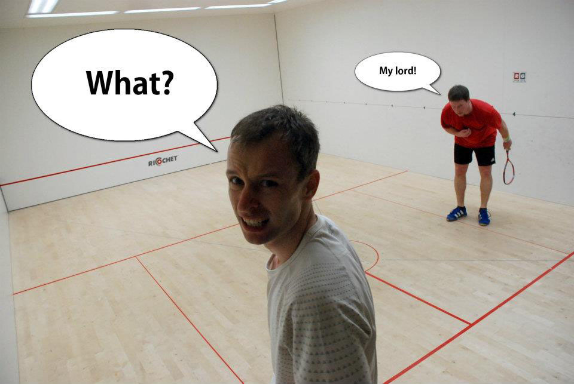
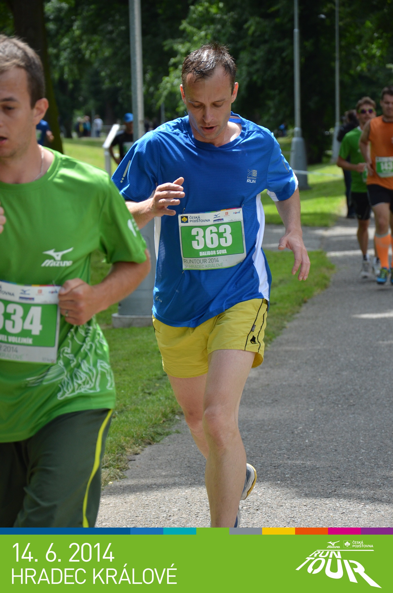
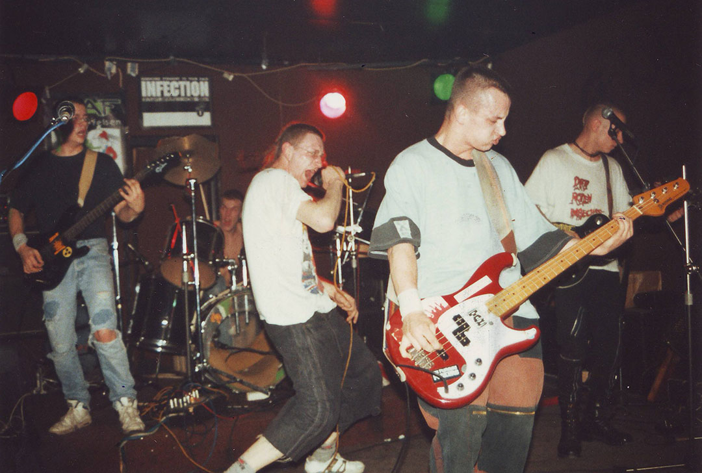
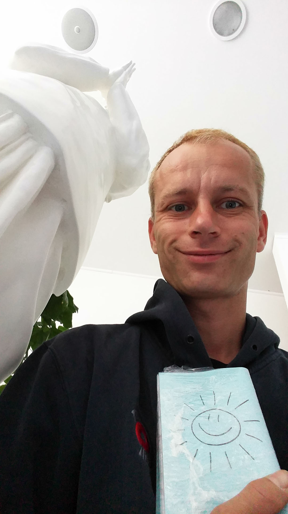

# Co dělám, když nedělám

### Ricochet
Posledním sportem, kterému jsem se věnoval, byl Ricochet. A i když už je to pár let zpátky, bavil mě dlouho a po 6 letech hraní jsem dosáhl neuvěřitelného výsledku. Byl to první turnaj nové sezóny a nikdo z dobrých hráčů na něj nepřijel. A já ho vyhrál a pak na celý další měsíc obsadil první místo v tabulce.

[No to bylo posměšků.](https://www.facebook.com/photo/?fbid=4921765661808&set=a.1224394629843) A i přes to, že dál jsem se tabulkou už jen propadal, jednou jsem tam byl, a to mi nikdo nevezme :-)

#
### Běhání
Dlouho se mě také drželo i běhací období. Rád jsem běhal, a rád i daleko. Nakonec i nějaký ten maratón padl. Nejlepším časem se tu ale chlubit nebudu, hlavně proto, že po letech si jím sám nejsem jistý. Ale tím nejhorším bylo 4:50, to byl ten úplně první :-)

Od operace kolene už neběhám. Během se mi na chvíli stal samotný život.
Ale až se věci kolem trochu uklidní a i koleno se dá zcela do pořádku, k běhu bych se rád vrátil a znovu se věnoval.

#
### Kapela
K hudbě mě to táhlo už od malička, ale prý jsem na to neměl sluch. A tak namísto hudby chodil jsem chvilku na fotbal, pak i na hokej, a nejdéle mě držel kickbox.

Láska k muzice však byla velmi silná, a třeba taková basa má jen 4 struny, a navíc úžasně zní. A tak se mi začal plnit můj sen největší a s kamarády jsme si založili hudební kapelu. Hráli jsme to, co nás baví - pořádný nářez - a vydrželo nám to spolu dlouho. V roce 1995 byl pak na světě demáč, jenž je i tím jediným, co z tohoto období zbylo. Demáč, a pak ten příjemný pocit, co vše jsme zažili. 

> [*Infection - Freedom 1995*](https://www.facebook.com/infectionfreedom)

#
### Meditace
Od hardcore to pak byl už jen krůček k meditaci. Kdy v 21 letech jsem hledal způsob, jak s ní začít, a našel jsem cestu, která mi dala vše, co jsem potřeboval. A tak jsem po ní kráčel tak dlouho, jak jen to šlo. Život sám šel naproti touze po vnitřním rozvoji. A jestli sport a muzika mi dali něco, tak s meditací se to nedá srovnávat.

Meditace nabízí možnost ztišit všechno uvnitř a ponořit se do vlastního příjemna. Člověk tím získá svobodu uvnitř svojí vlastní mysli. Svobodu v rozpoznání hodnot jednotlivých myšlenek a v následném výběru.

Medituji dodnes. Meditace je středobodem mého života a mou osobní největší výhrou.

[*Zpátky na hlavní stránku*](https://github.com/Sudip2708/3roky#14-listopadu-2023)

