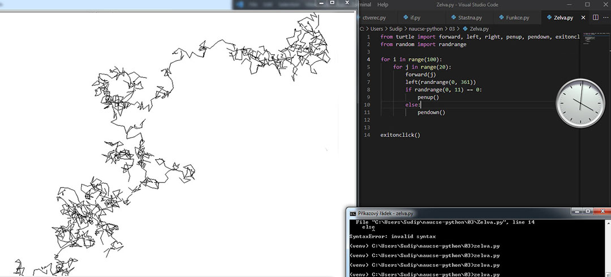

# Můj první program

### 9. 7. 2021
Po dlouhém výběru, ze kterého Python vyšel jako vítěz, shlížím první výuková videa. Dozvídám se o pseudo-náhodném generování hodnot a želví grafice. Přišla chuť experimentovat a tvořit.


Zapíšu jednoduchý kód:

```
from turtle import forward, left, penup, pendown, exitonclick
from random import randrange

for i in range(20):
    forward(i)
    left(randrange(0, 361))
    if randrange(0, 11) == 0:
        penup()
    else:
        pendown()
exitonclick()
```

A ono to něco tvoří! Testuji limity a nechám to 100x zopakovat. Pak 1000x a i 10000x. To už trochu trvalo a na výsledek jsem si musel počkat. Nevěděl jsem, že se to dá urychlit. Ale i to čekání mělo své kouzlo. 

Jen pár řádků kódu a najednou se něco dělo. Byl to moment, kdy skrze tuto pomyslnou klíčovou dírku, jsem zahlédl možnosti, co vše se mi otevírá a co mi může programování přinést. 

Už nebylo cesty zpět, oheň plál a já se chtěl dát učit.


[*Zpátky na hlavní stránku*](https://github.com/Sudip2708/3roky#23-%C4%8Dervenec-2021)
